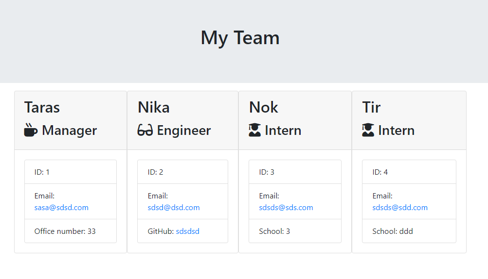

# Test-Driven Development: Team Profile Generator

## Description
This Node.js command-line application takes information about employees of a software engineering team and generates an HTML webpage that displays summaries for each person. Built with Test-Driven Development (TDD) approach, the application ensures that all development is guided by tests, aiming for high reliability and easy maintenance. This project includes unit tests for each part of the code to guarantee functionality.

## User Story

**AS A** manager  
**I WANT** to generate a webpage that displays my team's basic info  
**SO THAT** I have quick access to their emails and GitHub profiles

## Instructions

### Setup

1. Clone the repository and navigate to the project directory.
2. Install the necessary dependencies by running `npm install`.
3. Run the application using `node index.js`.

### Features

- Create command-line applications that accept user input.
- Use Inquirer.js for collecting input from the user.
- Classes for each team member type (Manager, Engineer, Intern) extend from a common parent class (Employee).
- Input validation to ensure the data is in the correct format.

### Classes

- **Employee**: Base class including properties for name, id, email, and methods for getName(), getId(), getEmail(), and getRole() (returns 'Employee').
- **Manager**: Extends Employee, adding officeNumber and overriding getRole() to return 'Manager'.
- **Engineer**: Extends Employee, adding GitHub username, getGithub(), and overriding getRole() to return 'Engineer'.
- **Intern**: Extends Employee, adding school, getSchool(), and overriding getRole() to return 'Intern'.

### Application Flow

1. Upon starting the application, the user is prompted to enter the team manager's details: Name, Employee ID, Email address, Office number.
2. The user is then presented with a menu option to add an engineer, add an intern, or finish building the team.
3. Depending on the selection:
   - **Add an Engineer**: Prompted to enter Engineer's Name, ID, Email, and GitHub username. Then, returned to the menu.
   - **Add an Intern**: Prompted to enter Intern's Name, ID, Email, and School. Then, returned to the menu.
4. When the user decides to finish building the team, the application exits, and the HTML is generated.

### Generating HTML

- The `render` function, provided within the project, takes an array of employee objects and generates HTML content.
- An HTML file is created using the returned HTML from the `render` function and written to `team.html` in the output directory.

### Validation

- The application includes validation checks to ensure user inputs are in the proper format, enhancing reliability.

## Technologies Used

- JavaScript
- Node.js
- Inquirer.js
- Jest for TDD

## Installation
  
1) git clone git@github.com:Oleksiieng/team-profile-generator.git
2) cd team-profile-generator
3) npm install
  
## Usage
  
node index.js
  
## Tests
  
npm test
  
## License
  
This project is licensed under the MIT license.
